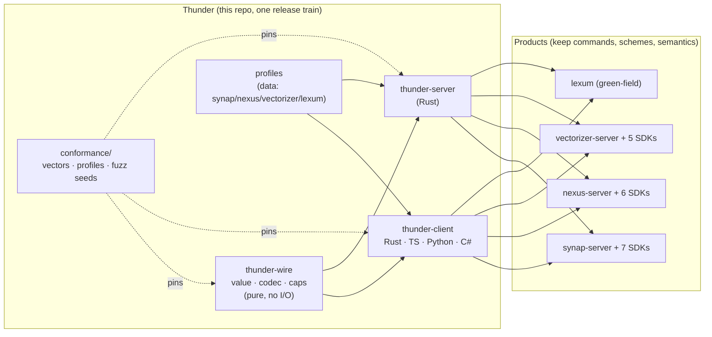

# Thunder — Architecture: The Best-of-Family Composite

> How Thunder becomes the best of all worlds in one standardized protocol: **every mechanism is
> the proven best of its kind somewhere in the family — or a corpus-pinned improvement none of the
> three implementations has**. Nothing here is speculative; every row cites its donor or its spec.
>
> Related: [PRD.md](PRD.md) (requirements) · [DAG.md](DAG.md) (build order) ·
> [SPEC index](specs/README.md) (normative) · [analysis §7](analysis/07-performance-baseline.md)
> (the donor-ranking evidence).

---

## 1. Design principle

Three server products implemented this protocol independently for years. That produced three
partially-overlapping sets of good engineering — and no single implementation that has all of it.
Thunder's architecture rule is therefore:

1. **Take each layer from its measured best donor** (§7 analysis: Synap server, Vectorizer client,
   Nexus spec/operations).
2. **Add only what has evidence** — either an in-family committed benchmark (BufWriter +23%), an
   empirical probe (bin `Bytes` −33% on embeddings), or a security invariant (cap-before-allocation).
3. **Freeze the result behind the conformance corpus** so the composite can never drift back apart.

## 2. System overview

## 3. The composite, layer by layer

### 3.1 Wire (`thunder-wire`) — Nexus source, one upgrade nobody has

| Element | Donor | Thunder addition |
|---|---|---|
| Value model, `Request`/`Response`, framing, externally-tagged encoding | `nexus-protocol` (most complete port source; bytes identical across the three — §7 T-029) | — |
| Cap-before-allocation, configurable | Nexus (`decode_frame_with_limit`) | Enforced in **all four languages**, encode and decode (WIRE-020) — today only the Rust paths and Vectorizer SDKs have it |
| `Bytes` encoding | **none** — all three Rust implementations emit int-arrays (probe, T-029) | **bin canonical** (`serde_bytes` path): −33% on embeddings vs every current implementation; legacy seq accepted on decode forever (WIRE-010/011) |
| Request shape | array (rmp-serde default, majority) | map-shaped requests tolerated server-side (Synap Py/Go/Java legacy, WIRE-013) |
| Decode API | — | **read returns the frame size** alongside the value, so metrics never re-encode (feeds SRV-007) |

### 3.2 Client (`thunder-client`, ×4 languages) — Vectorizer skeleton, best feature from each SDK

| Feature | Donor (best-in-family today) | Spec |
|---|---|---|
| Demux by id / pipelining | **Vectorizer Rust** (`oneshot` map + reader task — the only Rust client that pipelines, T-028) | CLT-010 |
| Streaming frame parser with cap | Vectorizer TS `FrameReader` | CLT (WIRE-020/022) |
| Connect timeout | Vectorizer C#/Go (10 s) | CLT-001 |
| **Per-call timeout + cancellation** | Vectorizer C# (`CallTimeout` 30 s + `CancellationToken`) / Go (`ctx`) — generalized to all languages | CLT-020/021 |
| Lazy reconnect, capped attempts | Synap TS/Rust (2-try) | CLT-030 |
| Push hook (`PUSH_ID`) | Synap (only product that ships push) | CLT-060 |
| Poison-on-malformed-frame | Nexus TS | CLT-014 |
| Sync + async clients (Python) | Vectorizer Python (only SDK with both) | FR-28 |
| Connection pool | Vectorizer (fixed-N, round-robin) | CLT-080 [P1] |
| **Typed error-code parsing** | **none** — zero SDKs parse `[code]`/`NOAUTH` today | CLT-050..052 |

### 3.3 Server (`thunder-server`, Rust) — Synap hot path, Nexus operations, Vectorizer TLS

| Element | Donor | Spec |
|---|---|---|
| **BufWriter + drain-then-flush** (burst → 1 syscall; **+23% measured**) | Synap listener | SRV-006 |
| `TCP_NODELAY`, idle timeout (slow-loris), inline zero-sync auth serialization | Synap | SRV-008/009/010 |
| Zero-copy reply values (`Arc`-friendly `Bytes`) | Synap (`Arc<[u8]>`, phase11) | value type design (T1.1) |
| Per-connection in-flight **semaphore**, configurable cap, slow-command WARN | Nexus | SRV-003, WIRE-020, SRV-031 |
| Metrics catalog (7 counters/gauges as atomics) | Nexus — **minus its double-serialization bug** (banned by SRV-007) | SRV-030, SRV-007 |
| Writer task owns write half behind mpsc | all three (family invariant F-010) | SRV-002 |
| HELLO reply construction, capabilities hook | Vectorizer handshake + Nexus reply shape, unified | SRV-014 |
| Optional TLS (`tokio-rustls`, config-gated) | Vectorizer (only server that ships it) | SRV-040 |
| Dispatch trait (single product integration point) | new — generalizes what all three hand-rolled | SRV-020 |

### 3.4 Profiles — the differences become data

The six dimensions the products legitimately diverge on (handshake, hello style, push, caps,
error convention, TLS) are a declarative `Profile`, shipped as a generated family registry —
server and SDKs of one product import the same constant and cannot disagree
([SPEC-002](specs/SPEC-002-profiles.md)). Custom construction stays public, so the registry never
gates a new product.

### 3.5 Conformance — Vectorizer's rigor, family-wide, plus what nobody has

Golden byte vectors (Vectorizer's method, extended to a full value/framing/tolerance matrix) +
Nexus's round-trip/partial-frame/oversize test matrix + **two things no repo has today**:
reference cross-decode against the original `nexus-protocol`, and pairwise cross-language fuzz.
All in the default CI run — never feature-gated ([SPEC-005](specs/SPEC-005-conformance.md)).

### 3.6 Benchmarks — claims become artifacts

The §6 shootout (Thunder vs RESP3 vs Bolt vs HTTP over one no-op engine, parity clients) with the
**G5 always-win gate**. Its per-cell numbers double as the regression harness proving the
composite beats each donor ([SPEC-007](specs/SPEC-007-benchmarks.md)).

## 4. The best-of matrix (donor → Thunder 1.0)

| Dimension | Best in family today | Thunder 1.0 |
|---|---|---|
| Server write path | Synap (BufWriter, +23%) | Synap's + single-serialization metrics (SRV-006/007) |
| Server bounds | Nexus (semaphore 1024) | profile-configurable semaphore (SRV-003) |
| Client concurrency | Vectorizer Rust / all non-Rust demux SDKs | demux everywhere, incl. Rust for Nexus/Synap (first time) |
| Timeouts | Vectorizer C# (connect+call+CT) | connect + call + cancellation, ×4 languages |
| Reconnect | Synap (2-try) | uniform lazy 2-try + typed failure |
| Push | Synap | profile-gated hook, ×4 languages |
| Frame-cap safety | Rust crates + Vectorizer SDKs | every language, encode **and** decode |
| Embedding payload | none optimal (all Rust = int-array) | bin canonical: −33% vs every current implementation |
| Error surface | Vectorizer emits `[code]`, nobody parses it | emitted **and** parsed into typed errors |
| Byte-compat guarantee | Vectorizer's pasted golden hex | corpus + cross-decode + pairwise fuzz in CI |
| TLS | Vectorizer server (rustls) | server + client, config/feature-gated |
| Publishing | 3 forced `-protocol` publishes per release | one release train; zero product protocol packages (§5 dissolution) |
| Performance claims | targets + conflated benchmarks | G5: transport-isolated, always-win, committed artifacts |

## 5. Beyond the donors — what exists nowhere today

1. **bin `Bytes`** — −33% on the family's flagship payload, probe-proven safe (T-029).
2. **Frame cap in all languages** — closes the 9-transport allocation gap (T-004).
3. **`[code]` error parsing** — makes Vectorizer's structured codes actually consumable (T-003).
4. **Per-call timeouts everywhere** — today only C#/Go have them.
5. **Metrics without re-encoding** — removes 2 serializations/op from the Nexus pattern (T-027).
6. **Language-neutral corpus + pairwise fuzz** — byte-compat as CI property, not convention (T-006).
7. **The profile registry** — product differences that can never desynchronize (T-010/T-023).
8. **One release train, zero forced protocol publishes** — the §5 dissolution (T-021/T-022).

## 6. Performance budget (verified at G5)

| Mechanism | Expected effect | Evidence class |
|---|---|---|
| Write coalescing (SRV-006) | pipelined throughput ↑ (donor artifact: +23% from buffer alone) | committed in-family benchmark |
| Single serialization (SRV-007) | per-op CPU ↓ vs Nexus pattern (removes 2 of 3 encodes) | code-path arithmetic; measured at T4.3 |
| bin `Bytes` (WIRE-010) | embedding payload −33%, KNN/ingest frames smaller → latency/throughput ↑ | probe-verified encoding sizes |
| Client demux (CLT-010) | per-connection ceiling 1/RTT → pipelined (donor artifact: 166k → 600k rps between `-P 1`/`-P 16`) | committed in-family benchmark |
| nodelay + connection-sticky auth | tail latency ↓ on small frames; zero per-request auth cost | documented in-family rationale |

The budget is deliberately conservative — G5's matrix turns each row into a committed number, and
the always-win gate makes any regression against RESP3/Bolt/HTTP (or against a donor) a
release-blocking defect.

## 7. What products keep (unchanged by design)

Command catalogs and typed wrappers · URL schemes and env/config names (values live in the profile
registry, ownership stays with the product) · capability semantics · REST/GraphQL/MCP/RESP3
surfaces · retry-with-idempotency policies. Thunder is everything below that line — and only that.
