# Thunder — Implementation DAG

Dependency graph of all implementation work items from empty repo to 1.0.0. Derived from the
[ROADMAP](ROADMAP.md) milestones and the [PRD](PRD.md) requirements; each task links the spec(s)
that govern it.

Conventions:

- **Task IDs** are `T<phase>.<n>` and are stable — commits, issues, and PRs should reference them.
- An edge `A → B` means **B cannot start until A is done** (hard dependency). Tasks with no edge
  between them may run in parallel.
- **Gates** (`G<phase>`) are the phase exit criteria — quality checkpoints that block everything
  downstream of them.
- The wire format is **already frozen** (v1, inherited from the family) — there is no wire-freeze
  gate; instead **G1 freezes Thunder's public API shape** per language family (value factories,
  client surface), and **G5 gates quantitative performance claims**.
- Phase 2 product-swap tasks (T2.1–T2.3) are mutually independent and may run in parallel; the
  same holds for the three language ports in Phase 3 (T3.1–T3.3).

## 1. Graph

```mermaid
graph TD
    subgraph P0["Phase 0 — Bootstrap & decisions"]
        T0.1["T0.1 Monorepo skeleton + CI<br/>(rust/ ts/ py/ cs/ conformance/, lints, 3-OS matrix)"]
        T0.2["T0.2 Registry name reservation<br/>(crates.io, npm org, PyPI, NuGet)"]
        T0.3["T0.3 Spec transplant + profile spec<br/>(docs/spec/ from rpc-wire-format.md v1)"]
        T0.4["T0.4 Corpus v0<br/>(golden PING/PONG + framing set)"]
        G0{{"G0: names reserved; spec merged;<br/>corpus v0 loadable"}}
        T0.1 --> T0.4
        T0.1 --> G0
        T0.2 --> G0
        T0.3 --> G0
        T0.4 --> G0
    end

    subgraph P1["Phase 1 — Rust stack + conformance harness"]
        T1.1["T1.1 thunder::wire<br/>(value, Request/Response, codec, caps,<br/>canonical Bytes=bin, legacy tolerances)"]
        T1.2["T1.2 Full corpus + Rust loader<br/>(value matrix, edges, tolerance vectors)"]
        T1.3["T1.3 Reference cross-decode + pairwise fuzz gen<br/>(nexus-protocol dev-dep, both directions)"]
        T1.4["T1.4 thunder::client<br/>(demux, handshakes, timeouts, reconnect,<br/>push hook, error prefixes)"]
        T1.5["T1.5 thunder::server<br/>(accept loop, writer task, semaphore,<br/>dispatch trait, metrics, profile enforcement)"]
        T1.6["T1.6 Shootout skeleton<br/>(no-op backend + Thunder & HTTP listeners)"]
        G1{{"G1: corpus + cross-decode green in default run;<br/>echo server ⇄ client under every profile;<br/>public API shape frozen"}}
        G0 --> T1.1
        T1.1 --> T1.2
        T1.2 --> T1.3
        T1.1 --> T1.4
        T1.1 --> T1.5
        T1.4 --> T1.6
        T1.5 --> T1.6
        T1.3 --> G1
        T1.4 --> G1
        T1.5 --> G1
        T1.6 --> G1
    end

    subgraph P2["Phase 2 — Product swaps (Rust) + crate dissolution"]
        T2.1["T2.1 Nexus swap<br/>(server + SDK onto Thunder, Profile::nexus,<br/>resp3 → nexus-server internal)"]
        T2.2["T2.2 Vectorizer swap<br/>(server + SDK, Profile::vectorizer)"]
        T2.3["T2.3 Synap swap + Bytes canonicalization<br/>(server-first bin emission, envelope/resp3 internal)"]
        T2.4["T2.4 Terminal shims + crate deletion<br/>(deprecated re-exports published,<br/>-protocol crates leave workspaces)"]
        T2.5["T2.5 Lexum onboarding<br/>(thunder deps + Profile::lexum, SPEC-015 references Thunder)"]
        G2{{"G2: product suites + corpus green;<br/>Synap emits bin, old SDKs still pass;<br/>SDKs publish with zero path deps"}}
        G1 --> T2.1
        G1 --> T2.2
        G1 --> T2.3
        T2.1 --> T2.4
        T2.2 --> T2.4
        T2.3 --> T2.4
        G1 --> T2.5
        T2.4 --> G2
        T2.5 --> G2
    end

    subgraph P3["Phase 3 — Language ports + SDK swaps"]
        T3.1["T3.1 TypeScript package<br/>(@msgpack/msgpack, FrameReader, bigint Int)"]
        T3.2["T3.2 Python package<br/>(sync + async clients)"]
        T3.3["T3.3 C# package<br/>(low-level MessagePackWriter/Reader, CT support)"]
        T3.4["T3.4 Nexus SDK swaps<br/>(TS, Python, C# internals → Thunder)"]
        T3.5["T3.5 Vectorizer SDK swaps"]
        T3.6["T3.6 Synap SDK swaps"]
        G3{{"G3: corpus green ×4 languages;<br/>9 SDK suites green on swapped internals;<br/>pairwise fuzz green"}}
        G2 --> T3.1
        G2 --> T3.2
        G2 --> T3.3
        T3.1 --> T3.4
        T3.2 --> T3.4
        T3.3 --> T3.4
        T3.1 --> T3.5
        T3.2 --> T3.5
        T3.3 --> T3.5
        T3.1 --> T3.6
        T3.2 --> T3.6
        T3.3 --> T3.6
        T3.4 --> G3
        T3.5 --> G3
        T3.6 --> G3
    end

    subgraph P4["Phase 4 — Quality floor + shootout"]
        T4.1["T4.1 Behavioral floor suite ×4<br/>(reconnect, timeouts, oversize refusal, push routing)"]
        T4.2["T4.2 RESP3 + Bolt listeners + parity clients<br/>(shared no-op backend; drivers validated vs redis-benchmark)"]
        T4.3["T4.3 Full matrix run + committed artifacts<br/>(p50/p99/qps/bytes, env headers)"]
        T4.4["T4.4 Product RPC-vs-HTTP harnesses<br/>(bulk, small search, pipelined polling)"]
        G4{{"G4: floor suite green in 4 languages;<br/>≥1 product commits a harness artifact"}}
        G5{{"G5: Thunder wins EVERY cell vs<br/>RESP3 / Bolt / HTTP (margin ≥10%)"}}
        G3 --> T4.1
        G3 --> T4.2
        T4.2 --> T4.3
        G3 --> T4.4
        T4.1 --> G4
        T4.4 --> G4
        T4.3 --> G5
        G4 --> G5
    end

    subgraph P5["Phase 5 — Fast-follows (post-1.0)"]
        T5.1["T5.1 Go port<br/>(vmihailenco/msgpack v5, corpus loader)"]
        T5.2["T5.2 Push/streaming v-next design<br/>(family push semantics beyond Synap SUBSCRIBE)"]
        T5.3["T5.3 PHP / Java on demand"]
        G5 --> T5.1
        G5 --> T5.2
        G5 --> T5.3
    end
```

## 2. Task table

| Task | Deliverable | Governing spec(s) | PRD reqs |
|---|---|---|---|
| T0.1 | Monorepo layout (`rust/`, `typescript/`, `python/`, `csharp/`, `conformance/`), workspace lints, CI matrix (fmt + clippy `-D warnings` + tests on Linux/macOS/Windows; tsc/eslint/vitest; ruff/pytest; dotnet build/test) | [SPEC-006](specs/SPEC-006-packaging-release.md) | NFR-08 |
| T0.2 | Names reserved on crates.io / npm / PyPI / NuGet; org decision (`@hivehub` (decided 2026-07-17)) recorded | SPEC-006 | FR-60 |
| T0.3 | `docs/spec/` transplant of wire v1 with provenance header; profile dimensions specified | [SPEC-001](specs/SPEC-001-wire-format.md), [SPEC-002](specs/SPEC-002-profiles.md) | FR-01, FR-10 |
| T0.4 | Corpus v0: canonical PING/PONG vectors + framing set, loadable data files | [SPEC-005](specs/SPEC-005-conformance.md) | FR-50 |
| T1.1 | `thunder::wire` layer (port of `nexus-protocol/src/rpc/`, canonical `Bytes`=bin via `serde_bytes`, array `Request`, decode tolerances, configurable cap) | SPEC-001 | FR-01..FR-06 |
| T1.2 | Full corpus (value matrix, int/float edges, framing edges, tolerance, push, handshake groups) + Rust loader in default test run | SPEC-005 | FR-50, FR-51 |
| T1.3 | Cross-decode vs `nexus-protocol` both ways; pairwise-fuzz seed generator | SPEC-005 | FR-52, FR-53 |
| T1.4 | `thunder::client` (reader task + oneshot demux, 3 handshake styles, connect/call timeouts, reconnect, push hook, error-prefix parsing, endpoint parser, optional rustls) | [SPEC-003](specs/SPEC-003-client.md) | FR-20..FR-27, FR-29 |
| T1.5 | `thunder::server` — hot path ported from the **Synap** listener (BufWriter drain-then-flush, nodelay, idle timeout; §7 T-027) + Nexus's semaphore/configurable cap/metrics-without-re-encode; dispatch trait, profile enforcement, PUSH_ID refusal, optional rustls | [SPEC-004](specs/SPEC-004-server.md) | FR-40..FR-45 |
| T1.6 | `thunder-bench` skeleton: no-op dispatch backend + Thunder and HTTP listeners + driver harness | [SPEC-007](specs/SPEC-007-benchmarks.md) | FR-70 |
| T2.1 | Nexus: server listener + Rust SDK onto Thunder; `resp3/` relocated into `nexus-server`; SDK gains pipelining | SPEC-006 §dissolution | FR-61, NFR-04 |
| T2.2 | Vectorizer: same swap; golden tests retained as transition double-check | SPEC-006 | FR-61 |
| T2.3 | Synap: swap + `Bytes` bin emission (server-first); `envelope.rs`/`resp3/` relocated | SPEC-001, SPEC-006 | FR-02, FR-61, NFR-04 |
| T2.4 | Terminal `#[deprecated]` re-export shims published for the three crates; crates deleted from workspaces; `cargo publish --dry-run` proof per SDK | SPEC-006 | FR-61, FR-62 |
| T2.5 | Lexum: `thunder` dep (features `server`) + `Profile::lexum()`; its SPEC-015 cites Thunder's spec | SPEC-002 | FR-11 |
| T3.1 | `@hivehub/thunder`: wire + client, `@msgpack/msgpack`, streaming FrameReader with cap, `bigint` Int policy, ESM+CJS | SPEC-001, SPEC-003 | FR-01..FR-27 |
| T3.2 | `hivellm-thunder`: wire + sync/async clients, `msgpack` ≥1.1, `use_bin_type` | SPEC-001, SPEC-003 | FR-28 |
| T3.3 | `HiveLLM.Thunder`: wire + client, low-level `MessagePackWriter/Reader`, per-call `CancellationToken` | SPEC-001, SPEC-003 | FR-22, NFR-02 |
| T3.4–T3.6 | Product SDK internals (TS/Py/C# × Nexus/Vectorizer/Synap) swapped to Thunder packages; per-SDK codec/transport files deleted; public APIs unchanged | SPEC-006 | FR-62, NFR-04 |
| T4.1 | Shared behavioral floor suite executed in all four languages | SPEC-003 §floor | NFR-07 |
| T4.2 | RESP3 listener (reuse family impl) + minimal Bolt v5 listener + parity clients validated against `redis-benchmark` | SPEC-007 | FR-70 |
| T4.3 | Full matrix run, artifacts committed under `bench-out/` with env headers | SPEC-007 | FR-71, FR-72, NFR-05 |
| T4.4 | Product-level RPC-vs-HTTP harness (bulk / small search / pipelined polling) | SPEC-007 | FR-73 |
| T5.1 | `thunder-go` + corpus loader | SPEC-006 | FR-63 |
| T5.2 | Push/streaming semantics proposal (coordinated with Synap's shipped SUBSCRIBE) | SPEC-001 §push | P2 |
| T5.3 | PHP/Java ports if demanded; corpus handed to per-product transports regardless | SPEC-005 | P2 |

## 3. Critical path

`T0.1 → T1.1 → T1.2 → T1.3 → G1 → {T2.x ∥} → T2.4 → G2 → {T3.1..T3.3 ∥} → T3.4..T3.6 → G3 → T4.2 → T4.3 → G5`

Phase 2 and Phase 3 fan out per product / per language; the longest single chain is the benchmark
program, which is why the shootout skeleton (T1.6) starts in Phase 1 rather than Phase 4.
