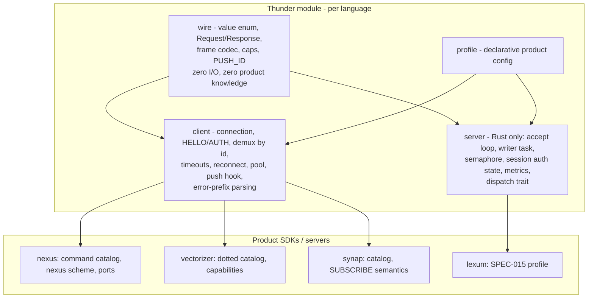

# §2 — Module Design: One Standard, Four Packages, One Profile

> This section proposes the architecture for the shared module — working name **Thunder** (this repository). Names are P0 decisions (§4), not commitments; registry availability must be checked before freezing them.

## 2.1 Goals and non-goals

**Goals**

1. One implementation of the wire layer per language, owned in one place, conformance-tested against one corpus.
2. Uniform client contract everywhere: demux by id, frame cap, connect + per-call timeouts, reconnection policy, error-code surface, push hook.
3. Product differences expressed as **data** (a profile), not as forked code.
4. Existing SDK public APIs unchanged — the module replaces SDK *internals*.

**Non-goals**

- No wire v2. The module implements the frozen v1 exactly (`Nexus/docs/specs/rpc-wire-format.md`); streaming/structured errors stay deferred exactly as the family already decided (F-005, §1.7 of the Lexum study).
- No command catalogs. `CYPHER`, `search.basic`, `vectors.insert` etc. stay in the product SDKs — commands are plain strings to the wire and adding them never touches the module.
- No replacement of HTTP/REST surfaces; RPC remains additive, as in every family product.

### T-009 — Every family server is Rust, so the module is one full stack plus three client-only ports

- **Evidence**: Synap, Nexus, Vectorizer, Lexum and Fluxum servers are all Rust workspaces; the non-Rust languages appear exclusively as SDK clients (§1.2, §1.3).
- **Impact**: the scope is smaller than "port everything to four languages". Rust gets `wire + client + server`; TypeScript, Python and C# get `wire + client`. The server layer (~120-line accept loop + mpsc writer + semaphore, F-010) is needed once, in one language.
- **Confidence**: high.

## 2.2 Layering



- **`wire`** is the ~600-LOC heart: the 8-variant value type, `Request`/`Response`, externally-tagged encode/decode, frame codec with cap-before-allocation, `PUSH_ID`, and the decode tolerances of T-005 (accept int-array `Bytes`, accept map-shaped `Request` server-side). Pure functions over buffers — no sockets — which is what makes it testable against the golden corpus in every language.
- **`client`** owns a connection: dial (+ optional TLS), handshake per profile, background reader with demux by id, write serialization, connect + per-call timeouts, bounded in-flight, lazy reconnect with capped retries, push-frame callback (id == `u32::MAX`), and error mapping (prefix → typed error). This is where today's 15 divergent behavior sets collapse into one.
- **`server`** (Rust) generalizes the pattern all three servers already share verbatim (F-010): accept loop → per-connection reader + mpsc writer task → `tokio::spawn` per request bounded by a semaphore → atomic session-auth flag → metrics atomics. Products implement one trait: `async fn dispatch(&self, session, command, args) -> Result<Value, ErrorString>`.
- **`profile`** is the six-dimension divergence table (F-011) as a struct.

### T-010 — The protocol profile makes one module serve all three existing server shapes

```rust
pub struct Profile {
    pub handshake: Handshake,        // None | AuthCommand | HelloMandatory
    pub hello_style: HelloStyle,     // PositionalVersion (Nexus [Int(1)]) | MapPayload (Vectorizer)
    pub push: PushPolicy,            // Reserved | Enabled(handler)
    pub max_frame_bytes: u32,        // default 64 MiB
    pub max_in_flight: u32,          // Nexus 1024 / Vectorizer 256
    pub error_codes: ErrorConvention,// None | Resp3Prefixes | BracketCodePrefix | Both
    pub tls: TlsPolicy,              // Off | Rustls(config)   (client: Off | Native/Rustls)
}
```

- **Evidence for the six dimensions**: the divergence table in `Lexum/docs/analysis/hivellm-rpc/02-implementations.md` F-011, confirmed and extended by §1's SDK sweeps (three handshake styles including Synap's "none"; two error conventions with zero client-side parsing today; push shipped only by Synap).
- **Impact**: `Profile::nexus()`, `Profile::vectorizer()`, `Profile::synap()`, `Profile::lexum()` ship **inside Thunder** as a family registry generated from data files (§5.3 T-023) — server and SDK of one product import the same constant and cannot disagree, and no per-product protocol package is needed to host it. New products (Lexum) pick values instead of writing code; the module's tests exercise every registered profile once, centrally.
- **Confidence**: high.

## 2.3 What stays in the product SDKs

| Stays product-side | Example |
|---|---|
| Command catalog + typed wrappers | Nexus `command_map.*` (CYPHER, STATS…), Vectorizer `commands.*` (2–3k LOC of typed wrappers), Synap `mapping.rs`/`CommandMapper` |
| URL scheme + default ports | `nexus://…:15475`, `vectorizer://…:15503`, `synap://…:15501` — a one-line scheme registration on the shared endpoint parser |
| Env/config names | `NEXUS_SDK_TRANSPORT`, etc. |
| Capability semantics | Vectorizer's HELLO `capabilities` list interpretation |
| High-level client ergonomics | query builders, model types, retries-with-idempotency policies |

This boundary is exactly where the agent sweeps found the generic/specific line in all 15 transports — the module absorbs everything below it, byte-identically.

## 2.4 Per-language design

### Rust — `thunder-wire`, `thunder-client`, `thunder-server`

- `thunder-wire`: deps `serde`, `rmp-serde 1.x`, `thiserror` only (no tokio) — the same zero-server-knowledge rule `nexus-protocol` documents (`rpc/mod.rs:24-31`). Type name: `Value` (products alias: `pub type NexusValue = thunder_wire::Value;` keeps source compat).
- `thunder-client`: tokio; reader task + `oneshot` demux (the Vectorizer Rust client is the best in-family starting point, `rpc/client.rs:186-291`); adds what no in-family Rust client has today: per-call timeout, reconnect policy, optional rustls.
- `thunder-server`: the F-010 pattern with the dispatch trait; metrics as atomics; `Profile`-driven handshake enforcement. Feature-gated `tls` (tokio-rustls, Vectorizer already proves it in-family).
- **Canonical `Bytes` fix**: `Value::Bytes(Vec<u8>)` must serialize as MessagePack **bin** — use `serde_bytes` (or a manual `serialize_bytes` impl) rather than Synap's seq-of-ints adapter; decode accepts both (T-005).

### TypeScript — `@hivellm/thunder`

- Client + wire only; Node `net` socket; ESM+CJS dual build like the existing SDKs.
- The value type is the discriminated union all three products already converged on independently (`{kind, value}` + factory helpers) — keep it.
- Decisions to make explicit: `Int` maps to `bigint` (Nexus already forces this, `codec.ts:55`) with `number` accepted on input for safe ranges; `Bytes` = `Uint8Array` → msgpack bin.
- Frame reading via the streaming `FrameReader` pattern (Vectorizer `codec.ts:87-136`) **with the cap enforced** — closing T-004 for TS by construction.

### Python — `hivellm-thunder` (import `thunder_rpc`)

- Ship **both** sync and async clients — Vectorizer proved the demand (its Python SDK carries both, 1,621 LOC; Nexus/Synap are async-only).
- `msgpack` ≥1.1 (already unanimous); `packb(use_bin_type=True)` for bin `Bytes`.
- Value as frozen dataclass `(kind, value)` + factories — the shape all three products already use.

### C# — `HiveLLM.Thunder` (NuGet)

- `MessagePack` (MessagePack-CSharp) using **low-level `MessagePackWriter`/`MessagePackReader` only** — the Vectorizer approach (`FrameCodec.cs:102-181`), which produces canonical compact ints and never touches `Typeless` (retires the T-004 deserialization risk).
- `net8.0`; `ConcurrentDictionary` + `TaskCompletionSource` demux; connect + call timeouts + per-request `CancellationToken` (the union of the best existing C# clients).

### T-011 — Per-language library decisions (one lib per language, chosen from what the family already runs)

| Language | Serialization choice | Rationale |
|---|---|---|
| Rust | `rmp-serde` 1.x | Unanimous today; it *defines* the encoding (externally-tagged is its default) |
| TypeScript | `@msgpack/msgpack` ^3 | Spec-strict, no custom extension surprises, proven with the golden vectors in Vectorizer; `msgpackr`'s speed can be revisited behind the codec interface once the conformance corpus exists to prove equivalence |
| Python | `msgpack` ≥1.1 | Unanimous today |
| C# | `MessagePack` 2.5.x, low-level API | Proven canonical bytes in Vectorizer; eliminates Typeless and hand-rolled codecs |
| (Go, fast-follow) | `vmihailenco/msgpack` v5 + `UseCompactInts(true)` | Already unanimous across all three products |

- **Impact**: three TS libraries → one; three C# strategies → one; hand-rolled codecs retired. Each choice is already production-proven inside the family — no new dependency risk.
- **Confidence**: high for Rust/Python/Go (unanimous today); medium for the TS pick (msgpackr is viable too — decide at P0, the corpus makes switching safe later).

## 2.5 Packaging and naming (P0 decisions)

| Registry | Proposed name | Note |
|---|---|---|
| crates.io | `thunder-wire`, `thunder-client`, `thunder-server` (or single `hivellm-thunder` with features) | check availability; the per-product `-protocol` crates are **dissolved**, not wrapped — terminal re-export shim for external downstream only, then deleted from the product workspaces (§5) |
| npm | `@hivellm/thunder` | existing SDKs publish under `@hivehub/*` — decide which org owns shared infra |
| PyPI | `hivellm-thunder` | import name `thunder_rpc` avoids collision with any `thunder` package |
| NuGet | `HiveLLM.Thunder` | matches `HiveLLM.Synap.SDK` convention |

Repository layout (this repo):

```
Thunder/
├── docs/               # THE spec lives here after transplant (§3.3) + this analysis
├── conformance/        # language-neutral golden corpus (§3.1)
├── rust/               # thunder-wire, thunder-client, thunder-server
├── typescript/
├── python/
└── csharp/
```

### T-012 — Monorepo with a shared conformance directory is the structure that keeps four languages honest

- **Evidence**: the failure mode it prevents is documented in-family: Vectorizer maintains the same golden hex pasted into six places (crate + 5 SDKs); Nexus/Synap have no vectors at all (T-006). A single `conformance/` consumed by all four test suites is only practical when the implementations live together.
- **Impact**: one PR changes wire behavior in all languages at once or fails CI; drift becomes structurally impossible rather than conventionally discouraged.
- **Confidence**: high.

### T-013 — Client contract: the uniform feature floor every port must meet

Every Thunder client, in every language, ships: demux by id (pipelining) · frame cap enforced on encode **and** decode · connect timeout (default 10 s) and per-call timeout (default 30 s, C#/Go already prove both) · lazy reconnect, 2 attempts, capped backoff · push-frame hook (profile-gated) · typed errors with prefix parsing per profile (`NOAUTH`/`WRONGPASS` → AuthError; `[code]` → code field) · TCP_NODELAY. This floor is the union of the best cell in each column of §1.3's matrices — nothing speculative, everything already proven somewhere in-family.

- **Impact**: T-003's scattershot matrix becomes a single row. Vectorizer's `[code]` prefix finally gets consumed (today zero SDKs parse it, §1.3), which is what makes SPEC-003-style structured errors usable over v1 without a wire change.
- **Confidence**: high.

### T-014 — The value API is the place to spend design care; the codec is a solved problem

- **Evidence**: all 15 transports independently converged on the same two shapes: a tagged-union value (`{kind, value}` / dataclass / sealed class) and factory constructors (`nx.int()`, `Value.str()`…). The subtle bugs found in the sweeps live at the value edges: BigInt vs number (TS), int-array vs bin `Bytes` (Synap), `Map` as pair-list vs native dict, NaN bit patterns, `{"Ok":{"Str":…}}` double-nesting.
- **Impact**: the module should standardize the *ergonomics* too (same factory names, same accessor names across languages — `as_str/asStr/AsString`), because that is what product SDK authors touch daily. The corpus (§3) pins every edge listed above.
- **Confidence**: high.

---

Next: [§3 — Conformance and versioning](03-conformance-and-versioning.md).
